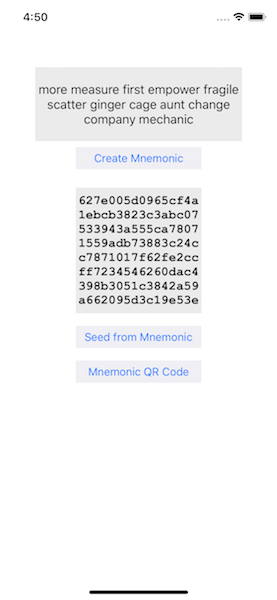
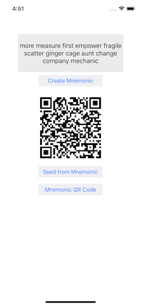

# Mnemo
Quick implementation of BIP-39 using nybex/NYMnemonic

- Re-arranged NYMnemonic code to simplify the interface
- Added QR Code for the generated QR Code
- Built with XCode 9.2 and minimal set of libraries

 
